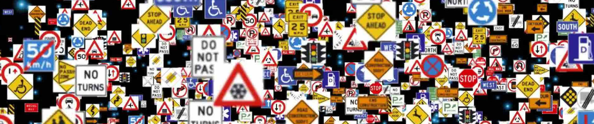

# GTSRB Traffic Sign Image Rec

MLOps Final Project

Between 20-50 million people are injured each year in traffic accidents and over 1 million die. These are now the global killers over individules ages 5-29. We have technology, Advanced Driving-Assistance Systems that are intended to aid drivers and improve safety. ADAS are an essential component of autonomous vehicles, and to that end, traffic sign recognition is a pertinent problem. Such systems can allow the vehicle to detect and recognize traffic signs in every direction, especially when drivers may not. The faster the rdetection and classification, especially compared to human reaction time, the greater the possible safety advantage granted to the driver.

To this end, sophisticated traffic sign classification systems are a necessary component of any ADAS system. This project will implement a toy example using a Convolutional Neural Network via Keras with the German Traffic Sign Recognition Benchmark (GTSRB). Although this is not ideal for a production vehicle, such applications could be useful for model testing by data scientists, or for monitoring production models as well as possible redundancy.

## Technology Used

- Python
- AWS Kinesis
- Docker
- Anaconda
- Jupyter
- Pipenv/Pyenv
- Tensorflow/Keras
- Convolutional Neural Networks
- MLflow
- Pytest
- Pre-commit (isort, black, pylint)

## Dataset

Downloading and unpack `make dataset`.

## Running code

Run `make setup`, or:
- Install virtual environment with `pipenv install` or use the requirements.txt file.

Run `make integration test` to build the Docker image and integration test.

### Terraform

0. Make sure you have a VPC with the appropriate permissions (like how we made in the course, able to use remote VS code, forward ports 4200, 5000 etc.) and your `aws configure` is set
1. cd to infrastructure/
3. Edit infrastructure/variables.tf as per your VPC
3. Run the terraform commands:
    1. terraform init
    2. terraform plan (optional: -out)
    3. terraform apply [--var-file=vars/stg.tfvars]
4. Connect to ports to see monitored services
